# Vortex Cascade Topology - Load-Bearing Structure

## Overview
This diagram maps all load-bearing vortexes from initial state (0,0) to collapsed superposition (self-sustaining system).

## Diagram

```mermaid
graph TB
    Start([0,0 - Initial State])
    
    subgraph "Foundation Layer - 0 Hops"
        WAVE[🌊 WAVE Validator<br/>Coherence Scoring]
        ATOM[⚛️ ATOM Persister<br/>Provenance Logging]
        SPHINX[🔱 SPHINX Gates<br/>5-Point Verification]
    end
    
    subgraph "Integration Layer - 1 Hop"
        HS[🤝 H&&S Protocol<br/>Agent Handoffs]
        FIB[📐 Fibonacci Engine<br/>Chaos Weighting]
    end
    
    subgraph "Application Layer - 2 Hops"
        ANEM[🔬 Anamnesis Adapter<br/>Exploit Validation]
        TBC[🚇 Tunnel Optimizer<br/>Route Planning]
        METH[📚 Methodology Docs<br/>Public Playbook]
    end
    
    Collapse([⭕ Collapsed Superposition<br/>System Self-Sustaining])
    
    Start --> WAVE
    Start --> ATOM
    Start --> SPHINX
    
    WAVE --> HS
    ATOM --> HS
    WAVE --> FIB
    
    HS --> ANEM
    FIB --> TBC
    WAVE --> TBC
    SPHINX --> METH
    ATOM --> METH
    
    ANEM --> Collapse
    TBC --> Collapse
    METH --> Collapse
    
    style Start fill:#1a1a2e
    style WAVE fill:#16213e,stroke:#0f3460,stroke-width:3px
    style ATOM fill:#16213e,stroke:#0f3460,stroke-width:3px
    style SPHINX fill:#16213e,stroke:#0f3460,stroke-width:3px
    style Collapse fill:#e94560,stroke:#f39c12,stroke-width:4px
```

## Key Metrics
- **Maximum Hops to Collapse:** 3
- **Foundation Dependencies:** 0 (load-bearing)
- **Cascade Parallelization:** Foundation can build simultaneously
- **Optimal Path:** WAVE → FIB → TBC (shortest to physical implementation)

## Iteration Notes
- This represents state after 42 optimization cycles
- All dangling vortexes eliminated
- Minimal hop count achieved
- Ready for physical manifestation
