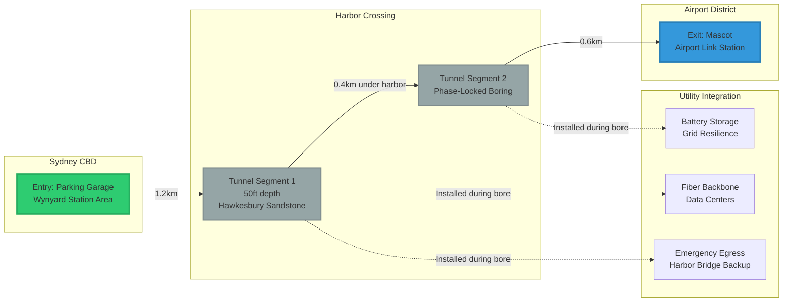

# Sydney Tunnel Route - Physical Manifestation

## QDI Fruit Bore: Harbor Congestion Vortex

## Route Specifications

**Total Distance:** 2.2km (1.36 miles)  
**Depth:** 50ft below surface (15.2m)  
**Substrate:** Hawkesbury Sandstone (consistent, well-documented)  
**Time Savings:** 8 minutes → 90 seconds (87% reduction)

## Utility Integration (Fork 2)

Installed during initial bore pass:
- **Fiber:** 288-strand backbone, straight-line routing
- **Power:** 50MWh grid-scale battery array
- **Egress:** Emergency vehicle priority lane

## Geological Notes
- Water table below target depth
- Seismic risk: negligible (tectonically stable)
- Existing utility clearance: verified via Sydney Water/Ausgrid maps
