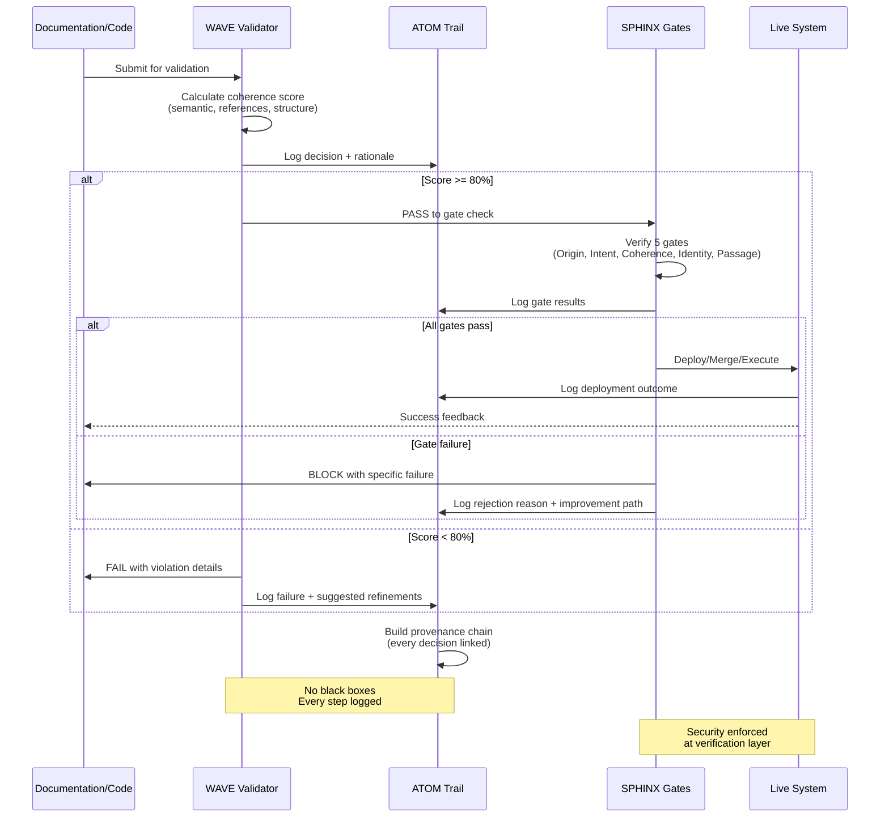

# WAVE-ATOM-SPHINX Integration Flow

## Decision Validation Pipeline

## Key Properties

**Transparency:** Every decision creates an ATOM entry  
**Traceability:** Full chain from input → outcome  
**Security:** SPHINX blocks invalid transitions  
**Iteration:** Failed validations include refinement guidance

## Integration Points

- **CI/CD:** WAVE runs on every PR
- **MCP Tools:** SPHINX gates exposed to AI agents
- **Audit:** ATOM trail queryable for compliance
